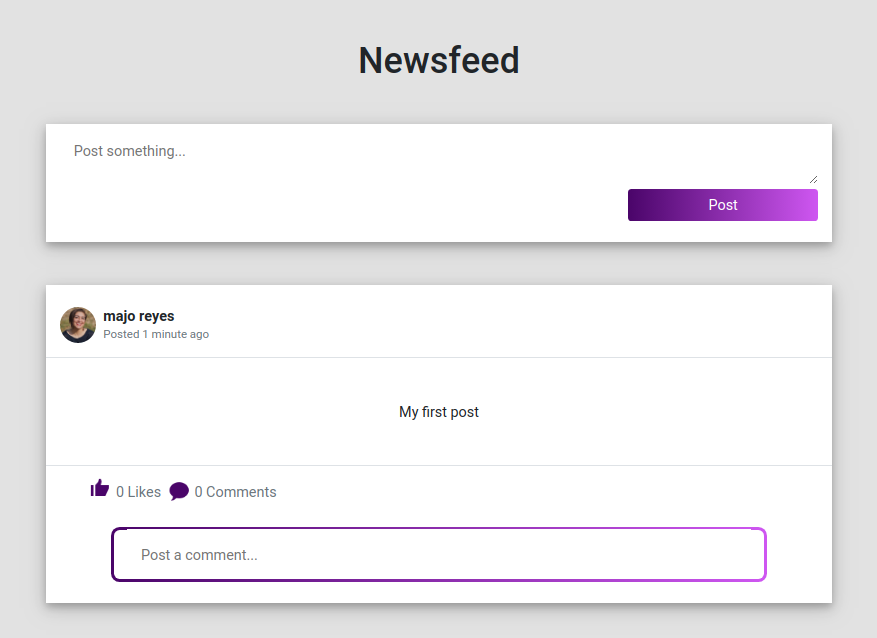

# Social Book

> This project is a basic Facebook Clone using Ruby on Rails 6.

Included features:

- You can login with your email or using your real Facebook account.
- Create posts. comments and likes.
- Add friends and accept friendships.

The objective of the project is to practice our Rails skills in:
  - Architecture Development using ERD
  - Understand MVC
  - Associations
  - Use Devise Gem for authentication
  - Behavior Driven Development

## Built With

- HTML, CSS and Ruby
- Ruby on Rails 6 Framework
- Bootstrap
- RSpec and Capybara
- Devise Gem
- Omniauth-Facebook Gem

## Live Demo

[Live Demo Link](https://serene-basin-51287.herokuapp.com/)

## Getting Started

**If you want to work on this project, follow the  instructions on setting it up locally.**

To get a local copy up and running follow these simple example steps.

### Prerequisites

You need to have installed in your computer:

- [Rails v. 6](https://guides.rubyonrails.org)

- [RSpec](https://rspec.info/)

### Setup
 
  - Download the repo and open it on your console.
  - Run `bundle install` on your console to install all the necessary gems.
  - Run `rails db:migrate` on your console to migrate the database.
  - Run `rails s` to open the app on your browser using http://localhost:3000/.

### Run tests

For testing the application you will need to run: `rspec spec`

## Authors

👤 **María Reyes**

- Github: [@majo_vainilla](https://github.com/majo_vainilla)
- Linkedin: [María José Reyes Parroquin](https://www.linkedin.com/in/majoreyesparroquin/)

This project is a fork from a collaborative project I made with Fabricio Garcia.

## 🤝 Contributing

Contributions, issues and feature requests are welcome!

Feel free to check the [issues page](issues/social-network).

## Show your support

Give a ⭐️ if you like this project!

## Acknowledgments

- Final Project of the Rails Section from the [Microverse Curriculum] (https://www.microverse.org/)
- We follow the instructions of [The Odin Project](https://www.theodinproject.com/courses/ruby-on-rails/lessons/final-project)

## 📝 License

Feel free to fork this project and improve it.
